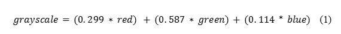
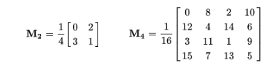
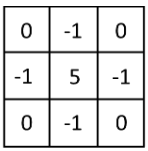
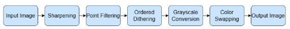

# Color-Quantization-Dithering
## Descrption
The purpose of this project was to replicate and experiment with a popular post-processing (and sometimes pre-processing) effect in video games to pixelate the scene. This effect is most well-known from the award winning game Dead Cells where it was utilized to render out 3D models and animations as 2D pixel art sprites and sprite sheets for efficient animation however, it is also useful as a stylistic post-processing effect in several other games as well. As such, our goal was to replicate this effect not only for its original intended use, but also to serve as an artistic finish for photographs, most notably those of scenic landscapes and backgrounds.

## Methods
To create the stylized pixel art look that is reminiscent of the iconic games that I drew inspiration from, I knew that the core of my algorithm would rely on downsampling in such a way that color value differences are accentuated between pixels. For this reason, I decided to utilize point filtering in order to sample every other pixel at different increments depending on a constant value and then upsample back up using these selected pixel values to the original image size. For this to work most effectively for every possible image dimension it is best if this resize factor constant value is maintained at a power of two. Once this simple color quantization algorithm was implemented, I also had intended to implement color remapping of the pixel values to a user inputted color palette. To do this, I first converted my image to grayscale using the luminance method which takes into account the human visual system’s natural sensitivities towards certain color values. The equation is as follows:

Now that the image was converted to grayscale (meaning it is 2-dimensional at this point), I could then round each value found within the image which was within the range of [0, 1] to their corresponding nearest neighbor based on a constant parameter for the number of colors which is inputted by the user. In this way, if n is the number of colors desired by the user, I used the following equation to remap the image.

After this remapping function, there are only n-many color values left in the image which I can easily loop through and index using NumPy’s array indexing to change the values of. It is important to note that on this step the color palette is mapped in from left to right or starting from index zero if inputted as a list where the first color is mapped to the darkest regions and the last color is mapped to the brightest regions. If I simply use this mapping however, an artifact called color banding can sometimes occur which is where colors appear to create band-like shapes in an image that look unnatural and can disturb the overall image aesthetically. Therefore, to combat this I implemented intentional noise in the form as ordered/bayer dithering before the grayscale operation. For my purposes I used the 2 x 2 and 4 x 4 Bayer Matrix which I had the algorithm select based on image size for efficiency and have included below. 

Then, following ordered/bayer dithering I created a noise 2-dimensional matrix which is equal in dimension to that of the image with only one color channel and mapped each coordinate of this noise matrix to a value in the Bayer Matrix by modding the x and y coordinates by the dimensions of the Bayer Matrix. Then, this noise matrix was subtracted by 0.5 uniformly across all pixels and multiplied by a user-defined parameter called spread which controlled the level of noise introduced to the image. Finally, the noise matrix was added to the final image which was then normalized to the [0, 1] range. This final image was then put through the aforementioned grayscale and color remapping functions in order to achieve a color-banding free image. The last thing I implemented as part of this project was a feature I added in hindsight because of the loss of certain semantic information. When there were many objects with harsh yet small edges in the scene or just a very busy scene in general these details usually became lost as a result of the downsampling and could not be shown in the final pixel art. In order to accentuate these details, I decided to add sharpening as the very first stage of this pipeline. In this way, I used a simple approximation of the laplacian operator which had the following kernel.

Which I then convolved with the image, using symmetric image replication for the boundary conditions. This convolution occurred on each color channel individually which, with normalization, produced the initial sharpened image. As such, the final pipeline for my pixel art algorithm including all of these processes was as follows.

## Contributors
- Aurora Jitrskul (@ajitrskul)
